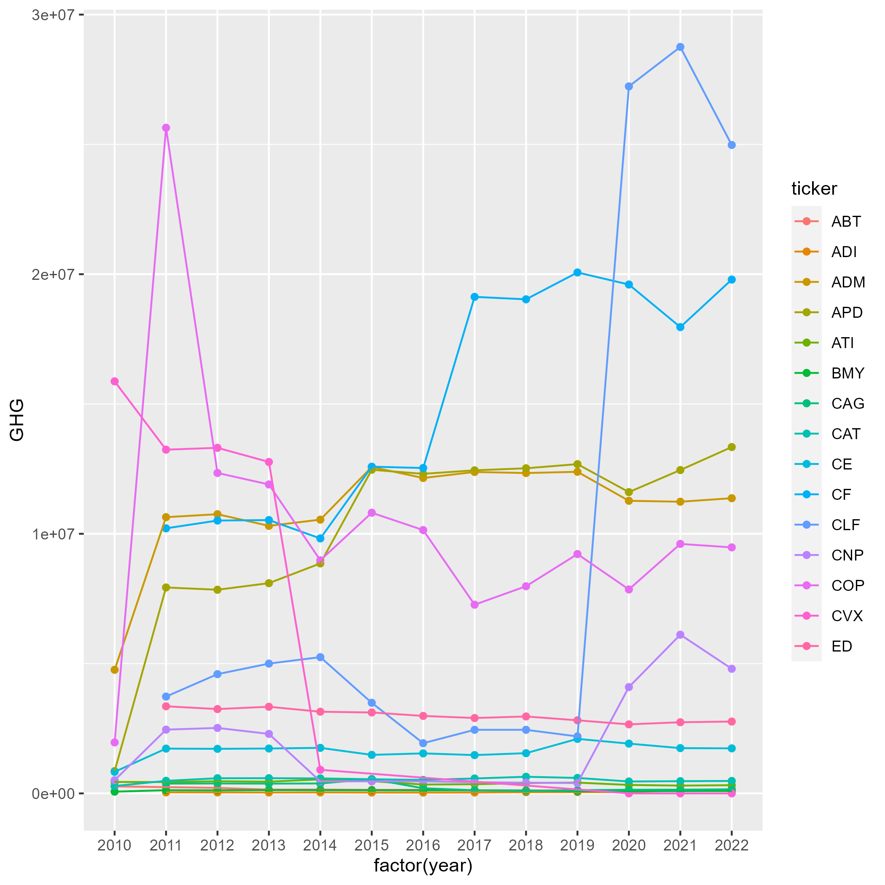
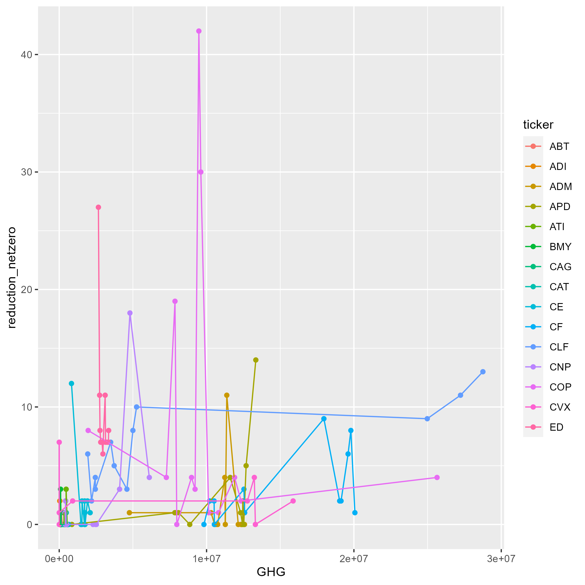

# Do changes in environmental corporate sentiment correlate with changes in GHG levels?
FIRE Sustainability Analytics
2024-11-22
Sohum Desai, Josh Hildebrand, Abhinav Akenapalli


# 1. Introduction

Understanding the impact of environmental corporate sentiment on changes
in greenhouse gas emissions emphasizes the importance of environmental
communication. By connecting how publicly traded companies communicate
their environmental sentiment with changes in their operation’s
greenhouse gas emissions, policymakers can better understand the impact
of regulation that requires ecological reporting. This connection
presents an opportunity to encourage companies to reduce their
greenhouse gas emissions and show society their corporate environmental
sentiment in their annual 10-K reports. This type of communication will
become more important as countries factor pollution output into the
costs of production to clean domestic manufacturing. It will also
further our knowledge on differentiating honest environmental sentiment
that is acted upon as reflected by their pollution levels compared to
“cheap talk” (Bingler et al., 2024). Through our data, we hold companies
more accountable for their communications of their environmental
impacts. By examining greenhouse gas emissions reported to the EPA’s
FLIGHT database, we can narrow our focus to directly connecting a
company’s sentiment of their pollution to the actual emissions they
generate. We can focus on this sentiment through closely examining the 
10-K reports of these companies in order to detect their environmental
sentiment compared to their actual greenhouse gas emission output. 

Our research boils down to three main parts. We had three main data sources which starts with the EPA Flight data to rack the greenhouse gas emissions from large facilities. Then, we have the SEC EDGAR 10-k reports which captures the communications made by these companies, and ClimateBERT which is utilized to classify environmental sentiment present in these communications. We started with 11,000 companies from the FLIGHT data which was then narrowed down to 100 publicly traded companies that had 13 years worth of emissions data and 10-k filing statements. Lastly, using ClimateBERT's net-zero/reduction model we were able to classify these sentences and compare this with the greenhouse gas emission data we have. 


# 2. Literature Review

- Presently, much work has been done on discerning genuine climate
  commitments and ‘cheap talk’. Current research concludes that firms
  with poor environmental action tend to communicate more environmental
  goals to “distract from poor performance” (Preuss & Max, 2023). This
  study focused on firms that were a part of the S&P 500 during the time
  of the sample space which was from 2010 to 2020. The reasoning behind this is that firms part of
  The S&P 500 were more likely to issue sociopolitical statements and
  are more likely to have PAC (Political Action Committees) contributions compared to smaller firms
  (Preuss & Max, 2023). This means that policies that intend to generate
  environmental commitments need to require clarity from companies if
  they want genuine environmental communications from companies.
  
  Identifying specific and genuine environmental communications has been
  done through ClimateBERT’s environmental claims detection model. Given
  their large data set, they decided to not manually verify if each
  statement contained a keyword, but instead they focused on generating
  n-grams which were 2-4 words in length. From here the study generated
  measures of sociopolitical claims per topic. Both of these
  measurements were based on the frequency of these n-grams within the
  sample data. The first measure was the number of times any n-gram
  appeared in the corporate filings data they collected and the second
  measure docs counted the number of documents per year that included
  two distinct environmental related n-grams. These measurements were
  the foundation to the conclusions and claims of the study. To clarify,
  these last sentences reference the input which can be fed into the ClimateBERT model for classification. 

- Our research uses the zero-emissions BERT large language model created
  by (Bingler et al. 2024), to detect sentences with planned GHG
  reduction sentiments and combine the output with GHG emissions to
  evaluate if a company’s pollution reflects their sentiment. The
  zero-emissions BERT large language model is a fine-tuned ClimateBERT
  language model with a classification head for detecting sentences that
  are either related to emission net zero or reduction targets. There
  are multiple studies that have utilized the climateBERT large language
  model, specifically a study completed by Bingler, relating Task Force
  on Climate-Related Financial Disclosures (TCFD) recommendations with
  the impact on disclosures of TCFD-supporting companies. This study is
  similar to ours, and utilized climateBERT to analyze the disclosures
  of TCFD-supporting firms. The model found “that the firms’ TCFD
  support is mostly just talk and that these firms cherry-pick to report
  primarily non-material climate risk information” (Bingler et
  al. 2022).

- Our research scans corporate communications from companies for
  sentences containing emissions information and changes in their
  corresponding pollution measured by the government. By examining these
  two variables we will see if companies support their environmental
  claims through changes in their emission levels.

# 3 Data

## 3.1 FLIGHT

The EPA FLIGHT data set shows our outcome variable which is the
greenhouse gas (GHG) emissions for large facilities. Using this data
set, the environmental impact of each company can be quantified. In
order to match these companies, to 10-K reports, the company list from
FLIGHT is fed into Chat GPT. The intuition is simple: companies that can
be associated with a stock ticker will be in the SEC EDGAR database. For
this reason, 11,000 companies were fed into CHAT GPT to determine if
each company had a ticker. The output was each company’s name and a
stock ticker or N/A if a ticker was not found. Chat GPT found 2578
companies with a ticker. Using a string distance library, the Chat GPT
output was merged with FLIGHT data to link GHG emissions with these
tickers. The string distance library was used to narrow down companies
that were repeats or companies that were not even in FLIGHT that Chat
GPT may have unintentionally added. Next, the number of years for each
company was examined. To keep data uniform and allow for the most
specific data, it was determined that only companies with 13 years of
data will be used in our data. The final result is 100 companies that
will be referenced in SEC EDGAR. Relating the GHG emissions from these
companies from the past 13 years to corporate sentiment from SEC EDGAR
10-K reports, a score can be determined for each company.

## 3.2 SEC EDGAR

10-K documents summarize a company’s financial performance and other
important information including their environmental and emissions
activity. By scraping the SEC EDGAR database, 10-K reports were
collected for our geographic unit, each company, for a frequency of each
year for the past 13 years and then parsed by sentence to create a data
collection of spreadsheets containing each sentence from each 10-K.
After gathering companies from the FLIGHT database, we filtered the
companies to only consider ones that are publicly traded. This ensures
that they will be in the SEC EDGAR database since this database only has
companies that are publicly traded. This task produced one spreadsheet
of sentences for the past 13 years for each of the 100 FLIGHT companies
yielding 1,300 spreadsheets. 

## 3.3 BERT

ClimateBERT is a large language model that is utilized to determine
whether the current sentence or phrase is a claim regarding
environmental sentiment or not. This model was developed from
DistilRoBERTa model, after some further training on both climate related
research papers and corporate/general news as well as company reports
(ChatClimate - About, n.d.). From here we decided to utilize the net
zero reduction model. This model is a fine tuned version of the
climateBERT model, and is able to classify if statements are either
related to emission net zero or reduction targets (ChatClimate - About,
n.d.). Thus, this model is an improved version of both the DistilRoBERT
model as well as the original climateBERT model. 

Basically the way we use this model, is we input a csv file of fragmented or whole sentences
into this net zero reduction model and one by one the model will return
a classification along with a confidence score which is our dependent
variable. Thus, once the entire csv has been ran through the model a new
csv with classifications and confidence scores has been produced. 

Now, we are able to draw conclusions and make claims regarding companies
communications regarding net zero reduction and their actual greenhouse
gas emissions. After the whole csv has been processed we can compare the
sentences classified as reduction and compare that to the total number
of sentences. This will then provide a ratio which we can compare with
any company along with their greenhouse gas emissions. The most crucial
part of this is that the ratio we calculate represent the fraction of
sentences with net-zero commitments. 

An example sentence which was identified as net-zero is: “After reconsidering the arguments for the
2018 final rule and finding them lacking, FHWA proposed to require State
DOTs and MPOs that have NHS mileage within their State geographic
boundaries and metropolitan planning area boundaries, respectively, to
establish declining targets for reducing CO2 emissions generated by
on-road mobile sources, that align with the Administration’s target of
net-zero emissions, economy-wide, by 2050, accordance with the national
policy established under section 1 of E.O. 13990, “Protecting Public
Health and the Environment and Restoring Science to Tackle the Climate
Crisis”, section 201 of E.O. 14008, “Tackling the Climate Crisis at Home
and Abroad”, and at the Leaders Summit on Climate.” The model
successfully parsed through this sentence was trained to identify this
as a sentence regarding net zero emissions.

```
sentiment = []
classifications = []

# Process each text entry
for text in df['V1'].tolist():
  try:
      result = pipe_env(text)
      sentiment.append(result)
      classifications.append(result[0]['label'])
  except Exception as e:
      print(f"Error processing text in {path}: {str(e)}")
      classifications.append("error")
      sentiment.append(None)

# Create results DataFrame
df_results = pd.DataFrame({
'text': df['V1'].tolist(),
'classification': classifications
})
```

In this code we can see a for loop which iterates through the dataframe, sentence by sentence, and classifies it passing the text as a parameter into pipe_env(). This is the most crucial step in the code as this is where each sentence is being passed into ClimateBERT. The return value is the classification and then we can append this to the array and generate a results dataframe containing these results. Also, it's important to note that we implemented a try catch block so that if any errors occur during classification, we can simply have "error" as the classification. 

To summarize: 
- The outcome variable is GHG emissions
- The dependent Variable is Corporate Sentiment score
- The frequency is year and geographical unit is each company

# 4. Summary

## 4.1 Data Cleansing Chart


Only publicly traded companies are required to report 10-K statements.
Thus, we parsed through each company in our EPA FLIGHT company list to
generate tickers only for that companies were publicly traded and
therefore have reported 10-K statements. From here we were able to then
scrape the SEC EDGAR collect data and create a csv file containing the
broken down 10-K statement’s sentences for each ticker-year. These csv
files were then process through the BERT net zero reduction model to
identify emission reduction sentences. Lastly we generate scores by
computing ratio of reduction sentences to total sentences in the 10-K
report and connected them to the quantity of GHG emissions for each year
as reported on EPA FLIGHT database.


## 4.2 Plot

 This plot shows the GHG per year for
each of the 15 companies.

 This plot shows the number of
reductions according to each GHG value for each of the 15 companies.


## 4.3 Empirical Analysis and Linear Regression

### Empirical Analysis

Our research examined the relationship between environmental corporate
sentiment and greenhouse gas emissions utilizing the following model.
Note, this is a simiplified version of what our research looked like to
give a glimpse into how we achieved our results.

    Sentiment_Score(i,t) = (Reduction_Sentences(i,t) + NetZero_Sentences(i,t)) / Total_Sentences(i,t)
    where:
    i = company identifier
    t = year (2010-2022)
    Reduction_Sentences = sentences classified as containing emission reduction commitments
    NetZero_Sentences = sentences classified as containing net-zero targets

To analyze the relationship between sentiment and emissions, we
estimate:

    Sentiment_Score(i,t) = β₀ + β₁GHG_Emissions(i,t) + γᵢ + δₜ + ε(i,t)
    where:
    β₀ = intercept term
    β₁ = coefficient measuring the relationship between GHG emissions and sentiment
    γᵢ = company fixed effects
    δₜ = year fixed effects
    ε(i,t) = error term

The sentiment score for each company-year observation is calculated as
the ratio of sentences classified by ClimateBERT as either emission
reduction or net-zero commitments to total sentences in the 10-K report.
GHG emissions are measured in metric tons of CO2 equivalent as reported
to EPA FLIGHT.

### Linear Regression Summary

``` r
library('tidyverse')
library('fixest')
df<-read.csv("finaldata.csv")

df2<-df |>
  mutate(score=(reduction+netzero)*100/sentences) |>
  mutate(PARENT.COMPANY=ifelse(str_detect(PARENT.COMPANY, "Chevron"), "Chevron", PARENT.COMPANY))
m1<-feols(GHG ~ score:as.factor(ticker) | ticker + year, data=df2)
summary(m1)
```

    OLS estimation, Dep. Var.: GHG
    Observations: 195
    Fixed-effects: ticker: 15,  year: 13
    Standard-errors: Clustered (ticker) 
                                 Estimate Std. Error   t value   Pr(>|t|)    
    score:as.factor(ticker)ABT 11015617.0    7032441  1.566400 1.3957e-01    
    score:as.factor(ticker)ADI  1006307.8   11561987  0.087036 9.3188e-01    
    score:as.factor(ticker)ADM  -575054.5    1242152 -0.462950 6.5051e-01    
    score:as.factor(ticker)APD  5063034.2    1816499  2.787248 1.4541e-02 *  
    score:as.factor(ticker)ATI -6625038.8    6270115 -1.056606 3.0858e-01    
    score:as.factor(ticker)BMY -6547807.0    5844456 -1.120345 2.8142e-01    
    score:as.factor(ticker)CAG -5801834.4   15110025 -0.383973 7.0677e-01    
    score:as.factor(ticker)CAT -6523751.3   12836426 -0.508222 6.1921e-01    
    score:as.factor(ticker)CE   2977058.6    4321171  0.688947 5.0212e-01    
    score:as.factor(ticker)CF  18430294.5    2608069  7.066643 5.6242e-06 ***
    score:as.factor(ticker)CLF 61671107.3    1819253 33.899132 7.7067e-15 ***
    score:as.factor(ticker)CNP  4577781.3    1659530  2.758481 1.5387e-02 *  
    score:as.factor(ticker)COP -8357158.9    1719811 -4.859349 2.5280e-04 ***
    score:as.factor(ticker)CVX -6210008.3    2206426 -2.814510 1.3781e-02 *  
    score:as.factor(ticker)ED    -50255.1    1035133 -0.048549 9.6196e-01    
    ---
    Signif. codes:  0 '***' 0.001 '**' 0.01 '*' 0.05 '.' 0.1 ' ' 1
    RMSE: 2,913,161.3     Adj. R2: 0.713618
                        Within R2: 0.369347

# 5. Discussion

## 5.1 Findings

After completing all of the research above, we actually found that there
is a pattern regarding corporate sentiment and actual changes in GHG
levels. We found that companies with higher GHG emissions consistently
produce more environmental reduction/net-zero commitments or statements
in their sentiment. This correlation suggests that companies who produce
more GHG emissions, attempt to make up for it or mask it via
environmental communication.

## 5.2 Quantitative Analysis

From the data we collected and processed there are various metrics that
show us this correlation between corporate sentiment and greenhouse gas
emissions. From the graphs produced, we can see that firms with
emissions that exceed 20 million GHG units, generally also have nearly
2-3 times more statements regarding reduction/net-zero commitments. It
is also important to recognize that even with communication increasing
through the years, the emissions remained pretty stable signaling that
there is no action behind these commitments. Lastly, when
reduction/net-zero statements are increasing, we also see higher
emission in these times.

## 5.3 Mechanisms

There are various mechanisms that drive this correlation between
corporate sentiment and GHG emissions detailed below. 
1. Implementation Timeline
   - It takes time for changes to be reflected once they are
announced. For example, if a given plan is announced it may take an
entire year for the change to be reflected in the data.
2. Mergers and Acquisitions
   - When companies merge or are acquired by others, there can
be an effect in the emission measurement. Relocation also plays a factor
in emissions measurements whether it could be an increase, decrease, or
loss of data.

## 5.4 Literature Context

Our findings are very similar and correlate with existing research.
Bingler et al.(2022) found that firms with poor environmental
performance tend to communicate more reduction/net-zero commitments to
“distract from poor performance.” Our study further validates this
phenomenon across a longer time frame with emissions data.

# 6. Future Plans

Our future plans for this project are vast, but some ways that we can
proceed have been detailed below. 

1. Industry Specific Research
   - Moving forward we could analyze sector specific patterns, and see if different
sectors have different correlations between GHG and corporate sentiment

2. Increased Timeframe and Firms
   - This data processing handling requires a lot of computing power, so with some more powerful computing
resources we may be able to expand our research across many more firms and years, ultimately making our findings more reliable.

3. Policy Influence
   - Another way to move forward includes researching more about policy changes and how they effect corporate sentiment. How effective are current disclosure policies? Do changes in these policies also change corporate sentiment?

# 7. References

- Bingler, J., Kraus, M., Leippold, M., & Webersinke, N. (2022). How
  cheap talk in climate disclosures relates to climate initiatives,
  corporate emissions, and reputation risk. Swiss Finance Institute
  Research Paper, (22-01)

- Preuss, S., & Max, M. M. (2023). Do firms put their money where their
  mouth is? Sociopolitical claims and corporate political activity.
  Accounting, Organizations and Society, 101510

- ChatClimate - About. (n.d.). Frigg.eco.
  <https://www.chatclimate.ai/climatebert>

- Bingler, J., Kraus, M., Leippold, M., & Webersinke, N. (2022). Cheap
  talk and cherry-picking: What ClimateBert has to say on corporate
  climate risk disclosures. Sciencedirect Research Paper, (22-01)
